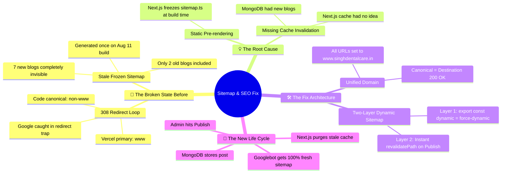
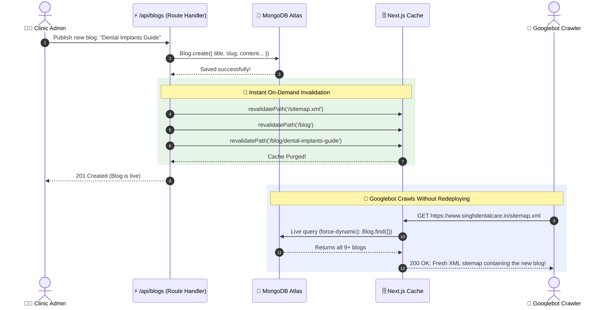

# 🐵 The "Monkey Map": Next.js Dynamic Sitemap & Canonical Fix
**File:** `sitemapdynamicfix.md`  
**Topic:** How we fixed the Stale Sitemap & the 308 Redirect Loop in Next.js App Router  

---

## 1. 🧠 High-Level Mental Map (The Mindmap)



---

## 2. 🍌 The "Monkey Analogy": How to Understand It in 30 Seconds

### The Problem (The Laminated Restaurant Menu):
* Imagine you run a restaurant called **Singh Dental Care**.
* On opening day (**August 11**), you print and **laminate a paper menu** with 2 dishes on it (`scaling` and `children`).
* Over the next two weeks, your chef invents **7 brand new delicious dishes** (implants, whitening, bad breath guide, etc.) and puts them in the kitchen freezer (**MongoDB**).
* But when food critics (**Googlebot**) walk into your restaurant, you hand them the old **laminated menu from August 11**.
* The critics leave thinking you only sell 2 dishes!

### The Fix (The Live Digital Screen):
1. **`force-dynamic`**: You throw away the laminated paper. You replace it with a **digital display screen** that checks the kitchen freezer (**MongoDB**) whenever a customer walks in.
2. **`revalidatePath`**: The instant your chef puts a new dish into the freezer, they tap a bell 🔔. The digital screen immediately flashes and updates the menu without restarting the restaurant.

---

## 3. 🔄 Before vs. After Visual Comparison

```
❌ BEFORE (Stale & Broken Loop)
┌─────────────────────────────────────────────────────────────┐
│ 1. Admin creates blog in dashboard                          │
│ 2. Blog saved to MongoDB Atlas                              │
│ 3. Next.js does NOTHING (sitemap.ts is frozen static file)  │
│ 4. Googlebot asks for /sitemap.xml                          │
│    ➜ Gets old build from Aug 11 (only 2 blogs)              │
│ 5. Googlebot visits blog with non-www canonical             │
│    ➜ Vercel hits Googlebot with 308 Redirect Loop           │
│    ➜ Google Search Console: "Page with redirect" (NO RANK)  │
└─────────────────────────────────────────────────────────────┘

✅ AFTER (Live, Synchronized & Canonical)
┌─────────────────────────────────────────────────────────────┐
│ 1. Admin creates blog in dashboard                          │
│ 2. Blog saved to MongoDB Atlas                              │
│ 3. API calls revalidatePath('/sitemap.xml') & ('/blog')     │
│    ➜ Stale cache vaporized instantly!                       │
│ 4. Googlebot asks for /sitemap.xml                          │
│    ➜ force-dynamic queries MongoDB live                     │
│    ➜ Returns ALL 9+ blogs with 200 OK!                      │
│ 5. Googlebot visits blog with www.singhdentalcare.in        │
│    ➜ Direct 200 OK! Zero redirects! Page gets indexed!     │
└─────────────────────────────────────────────────────────────┘
```

---

## 4. 🧭 Step-by-Step Lifecycle Flowchart



---

## 5. 📂 File-by-File Blueprint (What changed & why)

| File | What was wrong | What we fixed |
| :--- | :--- | :--- |
| [`app/sitemap.ts`](file:///D:/Amrit/SDC/mainwebsite/app/sitemap.ts) | 1. Hardcoded `https://singhdentalcare.in` (non-www)<br>2. Frozen statically at build time | 1. Changed to `https://www.singhdentalcare.in`<br>2. Added `export const dynamic = 'force-dynamic'` & `export const revalidate = 3600` |
| [`app/api/blogs/route.ts`](file:///D:/Amrit/SDC/mainwebsite/app/api/blogs/route.ts) | Created blog in MongoDB, but never notified Next.js cache | Added `revalidatePath('/sitemap.xml')`, `revalidatePath('/blog')`, `revalidatePath('/blog/[slug]')` |
| [`app/api/blogs/[id]/route.ts`](file:///D:/Amrit/SDC/mainwebsite/app/api/blogs/%5Bid%5D/route.ts) | Updated/deleted blog in MongoDB, but left old cached URLs | Added `revalidatePath` to both `PUT` and `DELETE` handlers |
| [`app/blog/[slug]/page.tsx`](file:///D:/Amrit/SDC/mainwebsite/app/blog/%5Bslug%5D/page.tsx) | 1. Canonical used non-www (causing 308 redirect)<br>2. Logo pointed to `next.svg` placeholder<br>3. No ISR revalidation | 1. Canonical set to `https://www.singhdentalcare.in/blog/${slug}`<br>2. Logo set to official clinic logo<br>3. Added `export const revalidate = 3600` |
| [`app/blog/page.tsx`](file:///D:/Amrit/SDC/mainwebsite/app/blog/page.tsx) | Missing canonical tag and OpenGraph URL | Added `alternates.canonical` pointing to `https://www.singhdentalcare.in/blog` |
| [`public/robots.txt`](file:///D:/Amrit/SDC/mainwebsite/public/robots.txt) | Sitemap pointed to non-www redirecting URL | Updated to `Sitemap: https://www.singhdentalcare.in/sitemap.xml` |
| [`app/layout.tsx`](file:///D:/Amrit/SDC/mainwebsite/app/layout.tsx) | Missing `metadataBase` | Added `metadataBase: new URL("https://www.singhdentalcare.in")` |

---

## 6. 🏆 The Golden Rules for Your Memory

1. **Rule #1 (The Canonical Rule):** Canonical URLs must **always return a direct 200 OK**. Never let a canonical URL point to a 301 or 308 redirect.
2. **Rule #2 (The Dynamic Rule):** When content lives in a database and is created after build time, your sitemap must use **`force-dynamic`** or **`revalidate`**.
3. **Rule #3 (The Purge Rule):** Whenever your admin panel writes to the database, always call **`revalidatePath`** so users and search engines don't have to wait for the cache to expire.
